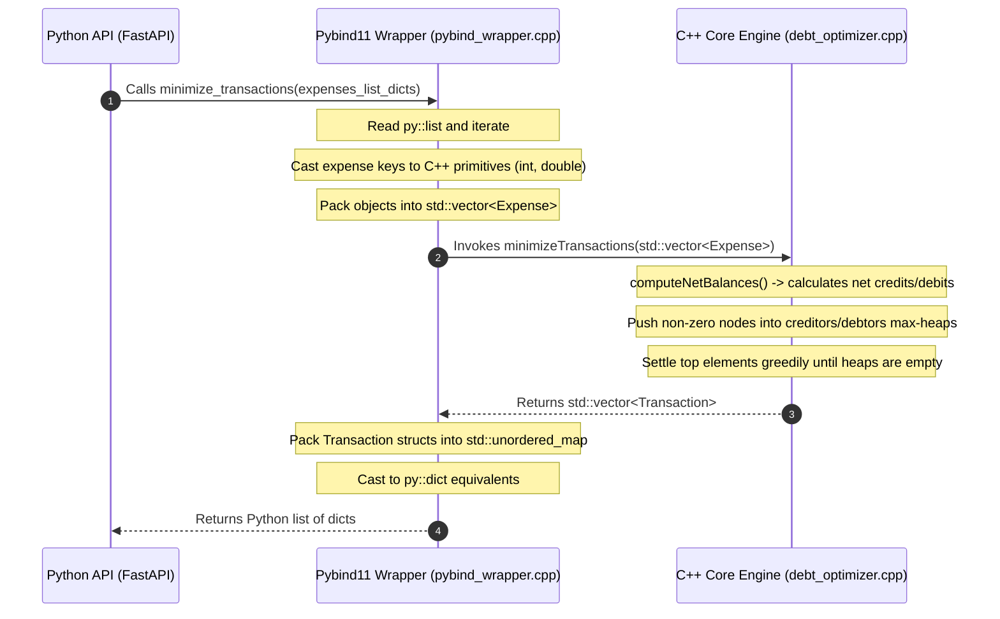

# FundyWise Core Engine Concepts: C++ Debt Optimizer & Pybind11 ⚡

This document explains the technical rationale, mathematical formulas, code structure, and execution flow of the C++ core engine used in **FundyWise**.

---

## 🧠 Why & Where C++ is Used

### 1. Why C++? (Technical Rationale)
Although Python (via FastAPI) is excellent for handling web requests, database transactions, and IO-bound operations, it is historically slow for CPU-bound computations due to several architectural constraints:
* **Dynamic Typing Overhead:** In Python, every variable is an object. Checking types at runtime and dereferencing objects creates significant CPU overhead.
* **Global Interpreter Lock (GIL):** Python's GIL restricts execution to a single OS thread. Offloading complex mathematical calculations to C++ allows us to release the GIL (`py::gil_scoped_release`) and process graph calculations in parallel across multiple CPU cores.
* **Cache Locality & Memory Layout:** C++ structures are stored contiguously in memory. This maximizes CPU L1/L2 cache hits. In contrast, Python lists contain pointers to fragmented object locations in RAM, causing frequent cache misses.

### 2. Where is it Used?
The C++ engine is placed in the `algorithm/` subdirectory. It is compiled into a shared library module (`debt_optimizer.so` on Linux, `.pyd` on Windows).
* **The Boundary:** The Python backend interacts with the compiled C++ code inside the `GET /groups/{group_id}/settlements` endpoint.
* **The Data flow:** Raw PostgreSQL entries are pulled into Python, serialized into dictionaries, passed across the Pybind11 boundary to the C++ core, optimized, and returned back to the web layer.

-## 🏗️ Code Snippets & Block-by-Block Analysis

---

### 📂 File 1: `models.h` (Data Structures Layer)
This file defines the primary C++ structures that store our in-memory group finance objects.

#### Block 1.1: `ParticipantShare` Struct
```cpp
struct ParticipantShare {
    int user_id;
    double share_amount;
};
```
* **Explanation:**
  * **`int user_id`**: Stores the unique identifier of the user in a 4-byte integer. Using integer IDs instead of string UUIDs saves significant memory and allows direct lookup and hashing.
  * **`double share_amount`**: Stores the exact share the participant owes for a given expense. A 64-bit `double` is used to allow high-precision decimal division.

#### Block 1.2: `Expense` Struct
```cpp
struct Expense {
    int expense_id;
    int group_id;
    int paid_by;
    double amount;
    std::vector<ParticipantShare> participants;
};
```
* **Explanation:**
  * **`expense_id` & `group_id`**: References the unique IDs of the expense and the group it belongs to.
  * **`paid_by`**: Stores the user ID of the person who paid the bill upfront. This user is the creditor for this specific expense.
  * **`amount`**: The total cost of the logged transaction.
  * **`std::vector<ParticipantShare> participants`**: A contiguous vector storing all shares of the users involved in this split. Storing this list as a vector in C++ ensures sequential cache locality.

#### Block 1.3: `Transaction` Struct
```cpp
struct Transaction {
    int from_user_id;
    int to_user_id;
    double amount;
};
```
* **Explanation:**
  * This structure represents the optimized settlement outputs.
  * **`from_user_id`**: The debtor (the person who must pay).
  * **`to_user_id`**: The creditor (the person receiving the money).
  * **`amount`**: The exact value of the transaction.

---

### 📂 File 2: `debt_optimizer.cpp` (Algorithmic Core)
This file implements the net balance calculation and the greedy max-heap matching algorithm.

#### Block 2.1: Net Balance Aggregation (`computeNetBalances`)
```cpp
std::unordered_map<int, double>
computeNetBalances(const std::vector<Expense>& expenses)
{
    std::unordered_map<int, double> balances;

    for (const auto& expense : expenses)
    {
        balances[expense.paid_by] += expense.amount;

        for (const auto& participant : expense.participants)
        {
            balances[participant.user_id] -= participant.share_amount;
        }
    }

    return balances;
}
```
* **Explanation:**
  * **`std::unordered_map<int, double> balances`**: An efficient hash-table mapping user IDs to their net balances.
  * **Payer Credit (`balances[expense.paid_by] += expense.amount`)**: Credits the payer's balance since they spent money on behalf of the group.
  * **Participant Debit (`balances[participant.user_id] -= participant.share_amount`)**: Iterates through the participants and subtracts what they owe.
  * **Complexity & Resolution:** Running in $O(E)$ time (where $E$ is the total count of expense shares), this step collapses all complex transactional loops. If $A$ owes $B$ and $B$ owes $A$, their balances automatically offset here, resolving circular debts.

#### Block 2.2: Heap Sorting and Epsilon Filtering
```cpp
    using HeapEntry = std::pair<double, int>; // Pair structure: {balance, user_id}

    std::priority_queue<HeapEntry> creditors;
    std::priority_queue<HeapEntry> debtors;

    const double EPSILON = 1e-6;

    for (const auto& [user_id, balance] : balances)
    {
        if (balance > EPSILON)
        {
            creditors.push({balance, user_id});
        }
        else if (balance < -EPSILON)
        {
            debtors.push({-balance, user_id});
        }
    }
```
* **Explanation:**
  * **`HeapEntry`**: A `std::pair<double, int>` storing the balance and the user ID. C++ sorts pairs lexicographically (first by the `double` balance, then by `int` ID), making it ideal for the heap.
  * **`std::priority_queue`**: Implements binary max-heaps. The queue automatically maintains the user with the largest balance at the top.
  * **`EPSILON = 1e-6`**: Floating-point conversions can leave micro-fractions (e.g. `0.0000001`). This constant filters out negligible numbers.
  * **Classification**: Positive balances go to `creditors`. Negative balances are converted to positive absolute values and pushed to `debtors`.

#### Block 2.3: Greedy Optimization Loop
```cpp
    std::vector<Transaction> transactions;

    while (!creditors.empty() && !debtors.empty())
    {
        auto [credit_amount, creditor_id] = creditors.top();
        creditors.pop();

        auto [debt_amount, debtor_id] = debtors.top();
        debtors.pop();

        double settled_amount = std::min(credit_amount, debt_amount);

        transactions.push_back({
            debtor_id,
            creditor_id,
            settled_amount
        });

        credit_amount -= settled_amount;
        debt_amount -= settled_amount;

        if (credit_amount > EPSILON)
        {
            creditors.push({credit_amount, creditor_id});
        }

        if (debt_amount > EPSILON)
        {
            debtors.push({debt_amount, debtor_id});
        }
    }

    return transactions;
```
* **Explanation:**
  * **`creditors.top()` & `debtors.top()`**: Retrieves the maximum creditor and maximum debtor in $O(1)$ time.
  * **`std::min(credit_amount, debt_amount)`**: Decides how much can be settled in this transaction. This amount is the maximum possible transfer that will fully clear at least one of the two users' balances.
  * **`transactions.push_back(...)`**: Logs the simplified debt transfer.
  * **Balance Reduction & Re-insertion**: Subtracts the settled amount from both users' balances. If a user still has an outstanding balance left (greater than `EPSILON`), they are pushed back into the heap in $O(\log V)$ time.

---

### 📂 File 3: `pybind_wrapper.cpp` (Bridge Layer)
This file handles the serialization and marshalling of dynamic Python dictionary structures into typed C++ structures and back.

#### Block 3.1: Python to C++ Unpacking Loop
```cpp
std::vector<Expense> expenses;

for (auto expense_obj : expenses_py)
{
    py::dict expense_dict = expense_obj.cast<py::dict>();
    Expense expense;

    expense.expense_id = expense_dict["expense_id"].cast<int>();
    expense.group_id = expense_dict["group_id"].cast<int>();
    expense.paid_by = expense_dict["paid_by"].cast<int>();
    expense.amount = expense_dict["amount"].cast<double>();

    py::list participants_py = expense_dict["participants"].cast<py::list>();
    for (auto participant_obj : participants_py)
    {
        py::dict participant_dict = participant_obj.cast<py::dict>();
        ParticipantShare share;

        share.user_id = participant_dict["user_id"].cast<int>();
        share.share_amount = participant_dict["share_amount"].cast<double>();
        expense.participants.push_back(share);
    }
    expenses.push_back(expense);
}
```
* **Explanation:**
  * **`py::dict expense_dict = expense_obj.cast<py::dict>()`**: Dynamically casts the Python list elements into Pybind11 dictionary representations.
  * **Primitive Casting (`.cast<int>()` / `.cast<double>()`)**: Extracts the keys (`expense_id`, `paid_by`, `amount`) from the dictionary and casts them to static C++ native primitives.
  * **Nested Loop**: Accesses the nested `"participants"` key, converts it to a `py::list`, and casts the participant details into `ParticipantShare` structures.

#### Block 3.2: Execution & Output Repackaging
```cpp
auto transactions = minimizeTransactions(expenses);

std::vector<std::unordered_map<std::string, double>> result;

for (const auto& t : transactions)
{
    result.push_back({
        {"from_user_id", static_cast<double>(t.from_user_id)},
        {"to_user_id", static_cast<double>(t.to_user_id)},
        {"amount", t.amount}
    });
}

return result;
```
* **Explanation:**
  * **`minimizeTransactions(expenses)`**: Runs the core greedy max-heap algorithm with the static C++ structures.
  * **`std::vector<std::unordered_map<std::string, double>>`**: Builds a standard vector of maps to store the outputs.
  * **`static_cast<double>()`**: Converts the integer user IDs (`from_user_id` and `to_user_id`) to doubles. This is necessary because the return container uses double-typed values for all dictionary keys to maintain a single uniform type definition.
  * **Return conversion**: Pybind11 automatically catches this returned structure and converts it into a Python list of dictionaries: `[{"from_user_id": 1.0, "to_user_id": 2.0, "amount": 25.0}]`.

#### Block 3.3: Module Initialization
```cpp
PYBIND11_MODULE(debt_optimizer, m)
{
    m.doc() = "FundyWise Debt Optimization Module";
    m.def(
        "minimize_transactions",
        &minimize_transactions,
        "Compute optimized settlement transactions"
    );
}
```
* **Explanation:**
  * **`PYBIND11_MODULE(debt_optimizer, m)`**: A macro that defines the entry point for the compiled binary extension. When imported in Python, it registers the module under the name `debt_optimizer`.
  * **`m.def(...)`**: Exposes the `minimize_transactions` function to the Python namespace under the name `"minimize_transactions"`, making it callable as `debt_optimizer.minimize_transactions(...)`.

---

## 🔄 End-to-End Logical Flow

Below is the execution flow detailing how a request navigates from the API down to the C++ core:


