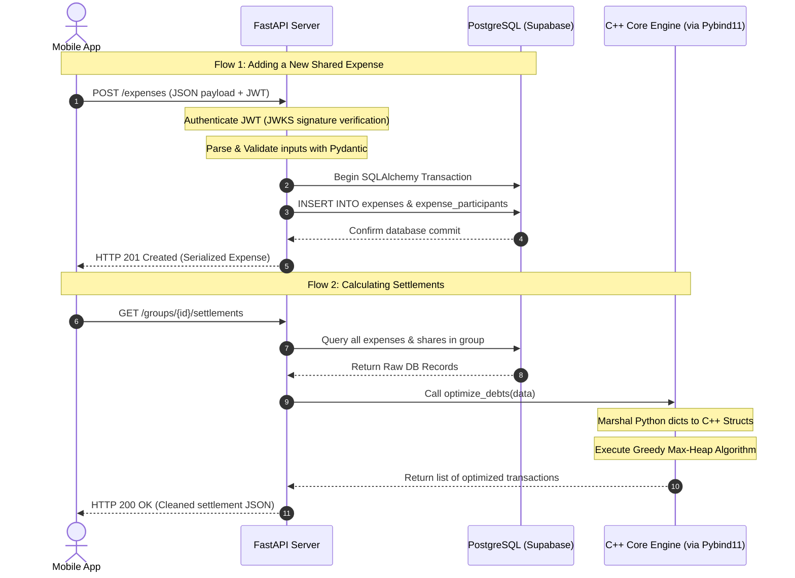

# FundyWise: Project Introductions Ledger 💰

This document houses two distinct introductions for **FundyWise**. 

* Use **Introduction 1** when pitching to senior technical interviewers, tech leads, or system architects. It focuses on the split-plane hybrid architecture, algorithmic complexity, type marshalling, and concrete engineering trade-offs.
* Use **Introduction 2** when explaining the project to non-technical stakeholders, friends, or family. It relies on intuitive analogies, practical scenarios, and high-level business value.

---

## 🚀 Introduction 1: High-Performance Technical & Architectural Overview
*Target Audience: Senior Technical Interviewers, Architects, and Tech Leads*

### 1. Project Concept & Core Use Case
**FundyWise** is a high-performance, mobile-first collaborative ledger and debt-simplification platform designed to resolve transaction graph complexities in shared finance environments. In typical group expense scenarios, settling debts generates an $N$-to-$N$ web of transactions, leading to high transaction fee overhead and operational complexity. FundyWise aggregates these expenses and executes a high-speed optimization algorithm, simplifying the payment graph to a maximum of $N-1$ transactions.

---

### 2. System Architecture
FundyWise uses a **split-plane hybrid architecture** to decouple the web-facing REST APIs and data management from the performance-critical computation engine.

```mermaid
graph TD
    subgraph Client-Side (React Native + Expo)
        A[Mobile App UI] -->|Auth Requests| B[Supabase SDK]
        A -->|REST API Requests| C[Axios HTTP Client]
    end

    subgraph Auth Provider
        B -->|Auth Operations| D[Supabase Auth Service]
    end

    subgraph Backend Server (FastAPI on Render)
        C -->|HTTP API Calls| E[FastAPI Routers]
        E -->|Business Logic| F[Services Layer]
        F -->|Pybind11 Bridge| G[Python Binding Wrapper]
        G -->|Optimize Debts| H[C++ Core Optimizer]
    end

    subgraph Database Layer
        F -->|SQLAlchemy ORM| I[(PostgreSQL - Supabase DB)]
        D -->|SQL Trigger Sync| I
    end
```

#### Layer Breakdown:
1. **Frontend (Mobile):** Built with **React Native (Expo)** in **TypeScript**. It utilizes conditional navigation stacks (Auth vs. App stacks) controlled by the user's active session state.
2. **Backend API:** Powered by **FastAPI** running asynchronously via **Uvicorn** (ASGI). It provides input validation using **Pydantic** schemas and asynchronous DB operations.
3. **Algorithmic Core:** A compiled **C++17** optimization module bound to Python via **Pybind11**. Decoupling this layer guarantees near-instant execution speed for large transaction sets.
4. **Database & Auth:** Hosted on **Supabase** with a **PostgreSQL** backend. We utilize **SQLAlchemy 2.0** for object-relational mapping (ORM) and local connection pooling.

---

### 3. The Core Debt-Simplification Algorithm
The core problem is mapping a directed graph of transactions onto a minimal set of edges that balance all nodes. While finding the *absolute minimum* number of transactions is NP-complete (mappable to the **Subset Sum / Partition Problem**), FundyWise implements an optimized greedy heuristic.

#### Algorithmic Steps:
1. **Balance Aggregation:** Compute the net balance $B_u$ for every user $u$ by aggregating their total paid expenses minus their total individual shares:
   $$B_u = \sum \text{Paid}_u - \sum \text{Share}_u$$
   This runs in $O(E)$ time, where $E$ is the total number of expense entries. Circular debts (e.g., $A \rightarrow B \rightarrow C \rightarrow A$) naturally cancel out here.
2. **Heap Classification:** Push creditors ($B_u > 0$) into a Max-Heap $H_c$, and debtors ($B_u < 0$) into a Min-Heap $H_d$ (using absolute values).
3. **Greedy Matching:**
   * Pop the maximum creditor ($u_c$) and maximum debtor ($u_d$).
   * Calculate the settlement amount:
     $$S = \min(B_{u_c}, |B_{u_d}|)$$
   * Record the transaction: $u_d$ pays $S$ to $u_c$.
   * Update the balances: $B_{u_c} \leftarrow B_{u_c} - S$ and $B_{u_d} \leftarrow B_{u_d} + S$.
   * Re-insert any non-zero balances back into their respective heaps.
   * Repeat until the heaps are empty.

#### Complexity:
* **Time Complexity:** $O(V \log V)$, where $V$ is the number of participants. Extracting and inserting into binary heaps takes logarithmic time, which is significantly faster than sorting arrays at each iteration ($O(V^2 \log V)$).
* **Space Complexity:** $O(V)$ to store net balances and heap elements.

#### Cross-Language Binding & Type Marshalling:
The Python service converts raw PostgreSQL models into dictionaries and invokes the C++ engine. **Pybind11** handles the type conversions:
* Python lists of dictionaries are marshalled into C++ `std::vector` of custom structures (`Expense`, `ParticipantShare`).
* The compiled shared library (`.so` / `.pyd`) executes natively without Python interpreter overhead.
* The GIL (Global Interpreter Lock) can be released in the C++ layer during calculations using `py::gil_scoped_release` to enable multi-threaded execution.

---

### 4. Data Flow: The Journey of an Expense
The following trace highlights the synchronous and asynchronous flows that occur during data updates and queries:



1. **JWT Verification:** When the client registers via Supabase Auth, a trigger (`on_auth_user_created`) mirrors the record to the public `users` table. The client attaches this JWT to all Axios requests. The FastAPI backend validates it statelessy using JWKS public keys.
2. **Transaction Insertion:** Incoming expenses are written into `expenses` and `expense_participants` tables inside a single SQLAlchemy ACID transaction. Rounding errors (e.g., splitting $10.00 three ways) are resolved on the server by allocating remainder cents to the payer.
3. **Settlement Extraction:** Upon requesting settlements, data is fetched, marshalled across the C++ boundary via Pybind11, calculated using binary heaps, and returned to the client as an optimized JSON array.

---

### 5. Engineering Advantages & Disadvantages

#### Advantages:
* **Algorithmic Efficiency:** Decoupling graph optimization to a C++ engine eliminates Python's dynamic typing overhead.
* **ACID Ledger Integrity:** Relational constraint definitions (e.g., `ON DELETE CASCADE` and strict foreign keys) prevent orphaned rows or corrupted expense histories.
* **Stateless Auth Scalability:** Validating JWTs using JWKS signature checks avoids hitting the database on every authenticated API request.
* **Responsive Mobile Views:** `FlatList` pagination, `React.memo` components, and Flexbox layouts ensure 60fps rendering of large ledger lists.

#### Disadvantages & Mitigations:
* **Boundary Crossing Overhead:** Passing small datasets between Python and C++ creates copy overhead. *Mitigation:* We run calculations in batch rather than calling C++ inside loops.
* **GIL Constraints:** Although C++ runs fast, it blocks Python's single thread unless handled. *Mitigation:* The backend utilizes asyncio, and we can release the GIL using scoped locks if dataset size warrants multi-core scaling.
* **Closed-Loop Payments:** The MVP outputs the settlement ledger but does not execute the actual transfer of funds. *Mitigation:* We plan to integrate payment gateways (Stripe Connect/Venmo API) to settle up with a single tap.

---

## 🍕 Introduction 2: Simple & Intuitive Overview
*Target Audience: Family, Friends, and Non-Technical Stakeholders*

### 1. The Real-World Scenario
Imagine you and five friends go on a weekend trip. 
* You pay $150 for the Airbnb.
* Friend B pays $60 for gas.
* Friend C pays $90 for a group dinner.
* Friend D pays $30 for sightseeing tickets.

At the end of the trip, you all sit down with receipts, calculator apps, and scratch paper, trying to figure out who owes what. You end up making a web of bank transfers: B pays A, C pays D, A pays C, and so on. You get charged multiple transaction fees, lose track of who paid, and argue over decimal roundings. 

**FundyWise solves this problem.** Everyone simply types what they paid into their phones. When the trip ends, the app does the math and outputs a single, clean payment plan: *"Friend B, pay Friend A $30; Friend C, pay Friend A $10—and the group is completely squared away."*

---

### 2. How the App Works: The "Restaurant" Analogy
To understand the structure of the application, imagine a busy, high-end restaurant:

```
[ Customer Table ]  <--->  [ Friendly Waiter ]  <--->  [ Head Chef ]  <--->  [ Locked Pantry ]
 (Friend Group)             (React Native App)          (FastAPI Backend)        (PostgreSQL DB)
                                                               |
                                                       [ Math Specialist ]
                                                        (C++ Core Engine)
```

1. **The Friendly Waiter (The Mobile App):** Built using **React Native**, this is the screen you interact with on your iPhone or Android. The waiter takes your order (e.g., logging a $60 dinner) and displays the menu (your expense history). The waiter doesn't cook the food; they just pass your requests to the kitchen.
2. **The Head Chef (The Backend API):** Powered by **FastAPI**, the Chef stands in the kitchen. When the waiter brings an order, the Chef decides how to process it, checks that the requests are valid, and makes sure everything runs smoothly.
3. **The Locked Pantry (The Database):** Hosted on **Supabase (PostgreSQL)**, this is a secure, digital cabinet. Every receipt, transaction, and user account is locked here. The Chef goes to the pantry to grab details or write down new logs so that no data is ever lost.
4. **The Math Specialist (The C++ Core Engine):** Inside the kitchen, there is a specialized accountant sitting in the corner. When a group clicks "Settle Up", the Chef hands all the trip receipts to this accountant. The accountant calculates the absolute simplest payment path in the blink of an eye and hands it back to the Chef to show the customers.

---

### 3. Key Advantages (Why use FundyWise?)
* **Saves Money:** By consolidating debts, it cuts down the number of transactions by up to 70%. Fewer transactions mean fewer bank transfer fees.
* **No More Math Arguments:** The app splits bills down to the exact penny automatically, eliminating rounding errors and friend group friction.
* **Lightning Fast:** Because we use a dedicated C++ math engine, calculations happen instantly, even if you have hundreds of expenses on a month-long trip.
* **One-Click Session:** The secure login system remembers you, so you only have to sign in once, and the app works smoothly in the background.

---

### 4. Current Disadvantages & Future Steps
* **No In-App Money Transfers:** Right now, the app tells you *who* to pay, but you still have to open your external banking app (like Venmo, Google Pay, or Apple Pay) to send the money. We are currently working on integrating a payment gateway so you can tap "Pay" directly inside FundyWise.
* **Requires Internet Connection:** If you are hiking in national parks with no cell service, you cannot log expenses in real-time. We are designing an "offline mode" that saves your logs on your phone and syncs them automatically once you get back online.

---

## 📊 Comparison: FundyWise vs. Splitwise
*A direct feature and architectural comparison between our high-performance ledger and the industry-standard Splitwise.*

| Feature / Dimension | **Splitwise (Industry Standard)** | **FundyWise (Our Solution)** |
| :--- | :--- | :--- |
| **Core Architecture** | Monolithic or Microservice web stack (e.g., Ruby/Go/Node) utilizing standard app-layer processing. | **Split-Plane Hybrid Architecture:** decoupling web APIs (FastAPI) from the compiled computational engine (C++17). |
| **Binding & Bridge** | Standard app-layer execution within VM/Interpreter. | **Pybind11 binding bridge** translating Python dictionaries directly into native C++ structs with zero VM execution overhead. |
| **Database Synchronization** | Application-level creation and syncing of user records. | **Database Trigger Synchronization:** Database-level trigger automatically mirrors authenticated Supabase users to public tables. |
| **Authentication Flow** | Classic session-based or server-validated OAuth tokens. | **Stateless JWT Validation:** FastAPI decodes and verifies Supabase signatures via JWKS public keys without database queries. |
| **Optimization Engine** | Server-side transaction graph simplification (proprietary). | **Greedy Max-Heap Algorithm** running in C++ at $O(V \log V)$ time complexity for ultra-low latency settlements. |
| **Precision / Rounding** | Server-side or client-side floating-point/decimal rounding. | **Cent-Precision Integers:** Currencies stored as big integers in cents; fractional cent remainders are programmatically allocated to the payer to ensure net-zero group balance. |
| **User Experience (Ads/Paywall)** | Freemium model with search limitations, transaction limit alerts, and ads. | **100% Ad-free, Unlimited, High-performance** MVP. |
| **Advanced Features** | OCR receipt scanning, multi-currency conversions, and direct payment gateway integrations. | *Roadmap:* Currently equal splits only, default single currency, with OCR receipt scanning and Stripe integrations planned. |

